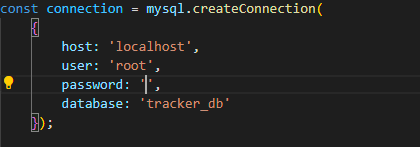

# Employee Tracker Application

A simple command-line application for tracking employees, departments, and roles within your organization.

## Table of Contents

- [Introduction](#introduction)
- [Features](#features)
- [Getting Started](#getting-started)
  - [Prerequisites](#prerequisites)
  - [Installation](#installation)
- [Usage](#usage)
  - [Starting the Application](#starting-the-application)
  - [Using the Application](#using-the-application)
- [Database Schema](#database-schema)
- [Contributing](#contributing)
- [License](#license)

## Introduction

The Employee Tracker Application is a command-line tool that allows you to manage employees, departments, and roles within your organization. It provides features such as viewing all departments, roles, and employees, adding new departments, roles, and employees, and updating employee information.

## Features

- View a list of all departments.
- View a list of all roles, including their associated departments.
- View a list of all employees, along with their roles and managers.
- Add new departments to the organization.
- Add new roles to departments, specifying the title and salary.
- Add new employees, including their first name, last name, role, and manager.
- Update an employee's role within the organization.
- Gracefully exit the application.

## Getting Started

## Prerequisites

Before you begin, ensure you have met the following requirements:

- [Node.js](https://nodejs.org/) installed on your computer.
- [MySQL](https://www.mysql.com/) installed and running, and you have necessary database access.

## Installation

1. Clone this repository to your local machine:

   ```bash
   git clone git@github.com:Punk1776/Tracker.git

 2.  Navigate to the project directory: cd Tracker

 3. Install the required npm packages: npm install

 ## Usage
### Starting the Application
1. Ensure your MySQL database is set up with the necessary schema and tables. You can use the provided SQL scripts in the sql/ directory to create the required schema and seed data.
mysql -u your-username -p < sql/schema.sql
mysql -u your-username -p < sql/seeds.sql

2. 
ad your MySQL password inthe space in the pic
3. Start the application: npm start

## Using the Application
Follow the on-screen prompts to navigate and interact with the application. Use arrow keys and Enter to make selections.
You can view and manage departments, roles, and employees as described in the application's features.

## Database Schema
The application uses the following database schema:

department table: Stores department information.
roles table: Stores role information, including the department each role belongs to.
employee table: Stores employee information, including their role and manager.

## Contributing
Contributions are welcome! If you'd like to contribute to this project, please fork the repository and create a pull request with your changes.

## License
This project is licensed under the MIT License - see the LICENSE file for details.

vbnet
